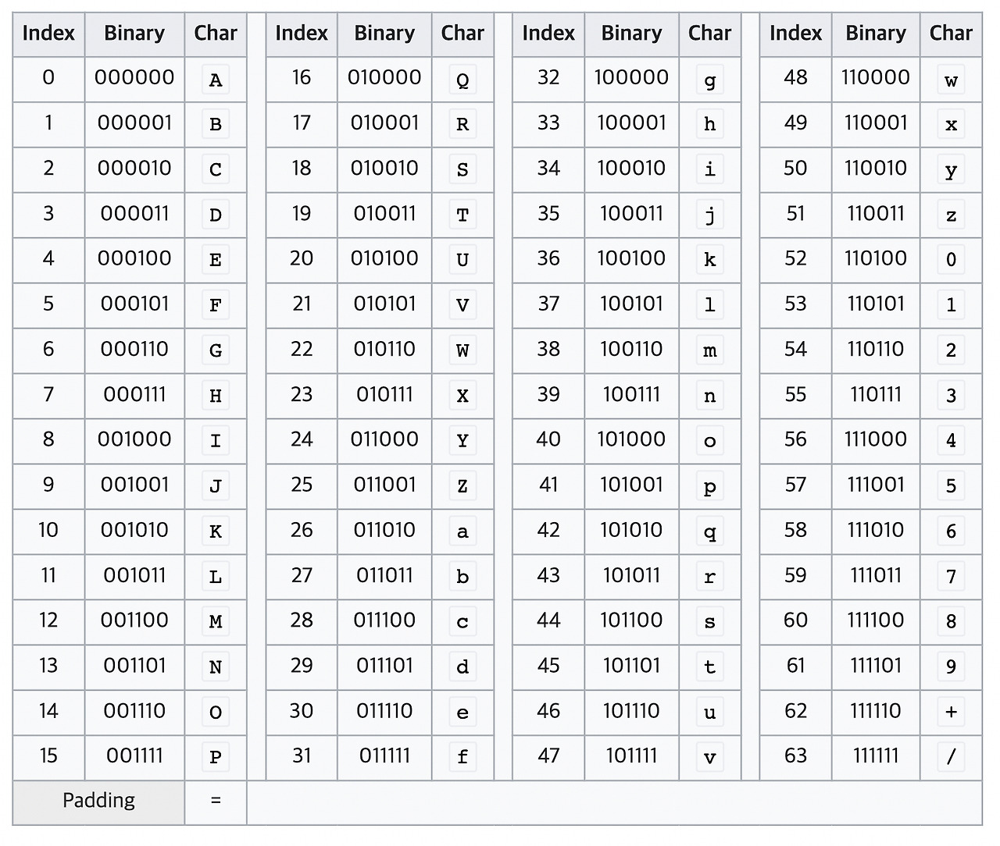

# Base64란?

Base64는 **64진법**의 의미를 가지며, Binary Data(8비트 이진 데이터)를 텍스트로 변경하는 인코딩 방식 중 하나입니다. 바이너리 데이터를 문자 코드에 영향을 받지 않는 공통 64개의 ASCII 영역의 문자들로 이루어진 문자열로 변경합니다.



## 왜 Base64를 사용할까?

- **64가 2의 제곱수**(64 = 2⁶)이며, 2의 제곱수들에 기반한 진법들 중에서 ASCII 문자들(대/소문자 알파벳, 숫자, +, /)을 써서 표현할 수 있는 가장 큰 진법입니다
- **보안이 아닌 호환성**을 위해 사용합니다 - 바이너리 데이터를 텍스트로 다루고 싶을 때 사용
- 신뢰할 수 없는 통신 채널을 통해 바이너리 데이터를 **안전하게 전송**할 수 있도록 합니다
- 통신 과정에서 바이너리 데이터의 **손실을 방지**하기 위해 사용합니다

---

## Base64 변환 과정

### 1단계: ASCII 변환
문자열을 ASCII 코드로 치환합니다.
```
예: 'H' → 72
```

### 2단계: 이진수 변환
ASCII 값을 8비트 이진수로 변환합니다.
```
72 → 01001000
```

### 3단계: 6비트 그룹 생성
Base64는 3바이트(24비트)를 4개의 6비트 그룹으로 나눕니다.
```
01001000 (8비트)
↓ 24비트를 만들기 위해 0을 16개 추가
01001000 00000000 00000000 (24비트)
↓ 6비트씩 분할
010010 | 000000 | 000000 | 000000
```

**6비트를 10진수로 변환:**
```
010010 → 18
000000 → 0
000000 → 0
000000 → 0
```

### 4단계: Base64 색인표 매핑
10진수 값을 Base64 색인표의 문자로 치환합니다.
```
18 → 'S'
0  → 'A'
0  → 'A'
0  → 'A'
```

### 5단계: Padding 처리

> **💡 Padding이란?**
> 
> 패딩은 불필요한 데이터를 채우는 것입니다. 만약 3바이트씩 정확히 끊어지지 않고 공백이 생긴다면, 인코딩 후 패딩 문자 `=`가 공백만큼 추가됩니다.

문자열 'H'는 1글자이므로 8비트입니다. 하지만 Base64는 24비트 단위로 처리하므로:
```
'SA' (2글자, 12비트)
↓ 24비트를 채우기 위해 패딩 2개 추가
'SA=='
```

### 최종 결과
```
'H' → Base64 인코딩 → "SA=="
```

---

## 핵심 정리

Base64 인코딩은 **6비트를 기준**으로 합니다. 하지만 문자열 1글자는 1바이트(8비트)이기 때문에, 6과 8의 최소공배수인 **24비트씩 끊어서 인코딩**합니다.

이를 통해 바이너리 데이터를 텍스트 형태로 안전하게 전송할 수 있습니다.

---

## 참고 자료
- [JAVA Base64란 무엇인가](https://velog.io/@may_yun/JAVA-Base64%EB%9E%80-%EB%AC%B4%EC%97%87%EC%9D%B8%EA%B0%80)
